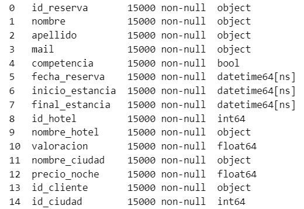
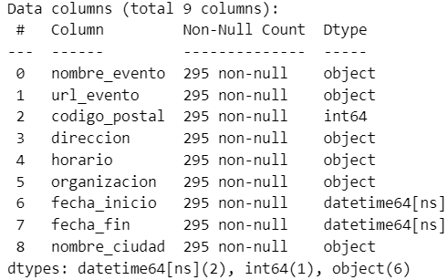
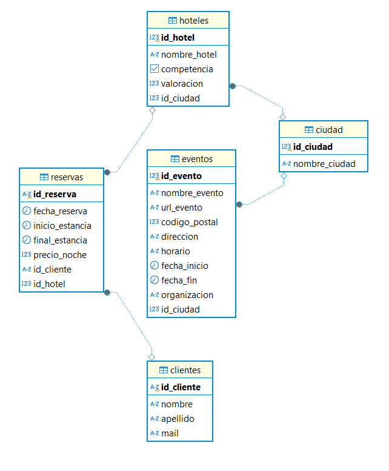

# 🔎Proyecto: ETL de Datos de Hoteles y Eventos en Madrid

**📃Descripción del proyecto**

Este proyecto realiza un análisis exploratorio y descriptivo sobre las reservas que se han hecho sobre los hoteles de nuestra empresa y los de la competencia. El objetivo principal del proyecto es extraer información relevante sobre los hoteles de la competencia y los de nuestra empresa, además de obtener información sobre los eventos que se han llevado a cabo en la ciudad donde se han hecho las reservas de los hoteles, en este caso son todas en Madrid. Para ello, se extrae la información de tres tipos de fuentes: 

1. Archivo parquet que nos proporciona la empresa del cual obtenemos datos de los hoteles propios y los de la competencia. 
2. Realizar webscraping en la página web "Ibis Accor" para alimentar la información que falta sobre los hoteles de la competencia, y para ello se han cogido los 10 primeros que aparecen en la página web.  
3. Obtener informacion de los eventos de Madrid a través de la API del ayuntamiento para poder establecer correlaciones entre ocupación hotelera y eventos en la ciudad. 
 
El segundo objetivo es limpiar y estructurar los datos extraídos del fichero parquet, de la web y de la API.
Y el tercer objetivo es almacenar los datos transformados en un formato estructurado en una base de datos SQL.

**🗼Estructura del proyecto**

    ├── notebooks/             # Notebooks de Jupyter
    ├── scraper.ipynb
    ├── limpieza.ipynb
    ├── scraper_web.ipynb
    ├── carga_BBDD.ipynb
    
    ├── data/
	├── data_raw
	├── data_transform
    
    ├── src/                 # Scripts (.py)
	├── soporte_carga.py
	├── soporte_extract.py
	├── soporte_limpieza.py
	├── soporte_load.py

    ├── main.py
    ├── main_limpieza.py
    ├── main_extraccion.py
    ├── main_carga.py	
    ├── README.md            # Descripción del proyecto
    ├── .gitignor   # Archivo para no subir todo a github
    ├── requirements.txt     # Recap de instalaciones y version 
    ├── .venv         # Carpeta del entorno virtual del proyecto

**👩‍💻Instalación y Requisitos**

Este proyecto usa la versión de Phyton 3.12.4 y requiere de las siguientes herramientas:
 
- Biblioteca Pandas
- Biblioteca Numpy
- Biblioteca psycopg2
- Biblioteca selenium
- Biblioteca requests
- Postgres SQL
- Gráfica Boxplot
- Gráfica matplotlib.pyplot
- Gráfica Matplotlib.pybar

**🤓Resultados y Conclusiones**
 
Este proyecto ha cumplido con los tres objetivos previstos:
 
1. Extracción de los datos: Se ha extraído correctamente el archivo reservas_hoteles.parquet y se ha obtenido la información requerida a través de la API y del Webscraping para cargarla luego en la base de datos SQL.

2. Transformación y limpieza de los datos: Se han limpiado y estructurado los datos extraídos de la web para que sean comparables con los datos de nuestro archivo original, además de limpiar los de eventos extraídos de la API.
 

 
3. Carga de los datos: Se han almacenado los datos transformados en un formato estructurado en una base de datos SQL.
 

   
**👉Próximos pasos**
 
Durante la ejecución del proyecto, me he enfrentado a varias problemáticas:

1. Mala planificación y organización
El planteamiento que habia hecho en un principio y la manera en la que lo había organizado no eran óptimas, lo que ha hecho que me replantease los pasos a seguir para extraer y transformar los datos.

2. Errores en los códigos
Ha sido el principal inconveniente de que la planificación que había pensada en un principio no saliese adelante.
 
3. Faltan ficheros .py + análisis
Debido a las dos problemáticas que he mencionado antes no me ha sido posible terminar con los ficheros main_limpieza.py y main.py. Además, falta hacer el análisis sobre los datos que hemos cargado en nuestra base de datos. 
 
Por el contrario, las ventajas de haber hecho este proyecto:

1. Practicar todo lo aprendido
Hacer este proyecto me ha servido para recordar todos aquellos conocimientos que he ido adquiriendo a lo largo del curso, con lo cual me ha servido para aprender de los errores que he ido cometiendo para que en los próximos proyectos que haga sea más eficiente.
   
**✍️Contribuciones**
 
Las contribuciones son bienvenidas. Si deseas mejorar el proyecto, por favor abre un push request o una issue.
 
**🗯️Autores y Agradecimientos**
 
**Claudia Soler** - [@clausoler](https://github.com/clausoler/Proyecto_Hoteles_ETL)